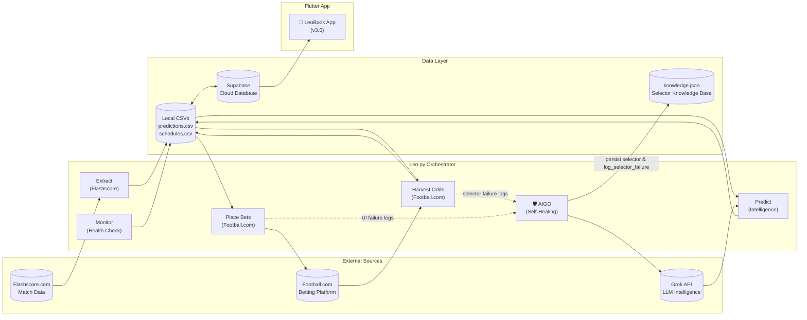

# LeoBook — Technical Master Report

> **Version**: 3.2 · **Last Updated**: 2026-02-23 · **Architecture**: Concurrent Clean Architecture (Sequential + Parallel Pipeline)

## Table of Contents

1. [System Overview](#1-system-overview)
2. [Project File Map](#2-project-file-map)
3. [Leo.py — Step-by-Step Execution Flow](#3-leopy--step-by-step-execution-flow)
4. [Design & UI/UX (v3.0)](#4-design--uiux-v30)
5. [Data Flow Diagram](#5-data-flow-diagram)

---

## 1. System Overview

LeoBook is a **fully autonomous sports prediction and betting system** comprised of two halves:

| Half | Technology | Purpose |
|------|-----------|---------|
| **Backend (Leo.py)** | Python 3.12 + Playwright | Autonomous data extraction, AI prediction, odds harvesting, bet placement, withdrawal management, and system health monitoring |
| **Frontend (leobookapp)** | Flutter/Dart | Elite dashboard with "Telegram-grade" density, liquid glass aesthetics, and proportional scaling |

**Leo.py** is a **pure orchestrator** — it contains zero business logic. All logic lives in the modules it imports. It runs in an infinite loop, executing a cycle every 6h. Starting v3.2, the engine uses **Concurrent Task Execution** to run non-blocking prologue tasks alongside the main chapter pipeline, and operates on a drastically simplified, first-principles codebase.

---

## 2. Project File Map

### 2.1 Root Files

| File | Function | Called by Leo.py? |
|------|----------|:-:|
| `Leo.py` | Central orchestrator — runs the entire system in a loop | **Entrypoint** |
| `.env` | API keys (Grok, Supabase), config (`LEO_CYCLE_WAIT_HOURS`, etc.) | ✅ via `dotenv` |
| `AIGO_Learning_Guide.md` | Documentation for the AIGO (AI Operator) subsystem | — |
| `leobook_algorithm.md` | Prediction algorithm whitepaper (v3.0) | — |
| `SUPABASE_SETUP.md` | Supabase setup instructions | — |

---

### 2.2 `Modules/` — Domain Logic Updates

| File | Function | Called by Leo.py? |
|------|----------|:-:|
| `fs_live_streamer.py` | **v2.1 Revision**: Parallel live score streaming with `extrasaction='ignore'` CSV robustness and 60s sync status propagation | ✅ (Parallel Task) |

---

### 2.3 `leobookapp/` — Flutter Architecture (v3.0)

The v3.0 rebuild implements a **Constraints-Based Design** system for uniform scaling.

| Directory | Feature | Purpose |
| :--- | :--- | :--- |
| `lib/core/constants/` | **`responsive_constants.dart`** | Central `Responsive.sp()` utility for dynamic font and spacing scaling |
| `lib/presentation/widgets/desktop/` | **Desktop-Only** | `DesktopHomeContent`, `DesktopHeader`, `NavigationSidebar` |
| `lib/presentation/widgets/mobile/` | **Mobile-Only** | `MobileHomeContent` — full mobile home layout with tabs |
| `lib/presentation/widgets/shared/` | **Reusable** | `MatchCard`, `FeaturedCarousel`, `NewsFeed`, `RecommendationCard`, `CategoryBar`, `LeoTab`, etc. |
| `lib/presentation/widgets/shared/league_tabs/` | **League Tabs** | Overview, Fixtures, Predictions, Stats tabs |
| `lib/presentation/screens/` | **Dispatchers** | Pure viewport dispatchers — render desktop or mobile widget tree |

---

## 3. Leo.py — Step-by-Step Execution Flow

Leo.py orchestrates 3 main chapters sequentially:

### Startup Flow
1. **Singleton Check**: Ensure only one instance runs.
2. **CSV Init**: Create local databases if missing.
3. **Browser Engine**: Launch Playwright context.

### Per-Cycle Logic (6h Cycle) — Concurrent Engine (v3.2)

Leo.py splits the cycle into three phases: Sequential Prep, Concurrent Execution, and Sequential Oversight.

#### Phase 1: Sequential Preparation (Prerequisite)
| # | Phase | Module Called | Action |
|---|-------|-------------|--------|
| 1 | **Prologue P1** | `SyncManager` | Bi-directional Supabase handshake (Sync on Startup). |
| 2 | **Prologue P1** | `outcome_reviewer` | Match score matching for results + Accuracy Report. |

#### Phase 2: Concurrent Pipeline (Parallel Execution)
| Execution Stream | Phase | Module Called | Action | Resume Logic |
|:--- | :--- | :--- | :--- | :--- |
| **Stream A** | **Prologue P2** | `enrich_all_schedules` | Extract team crests, IDs, and standings. | Skip if already enriched/needs not found. |
| **Stream A** | **Prologue P3** | `Data Access Layer` | Final Prologue sync & Accuracy generation. | Delta-based sync. |
| **Stream B** | **Chapter 1** | `manager.py` | Scrape today's fixtures and run AI predictions. | Skip if `fixture_id` already predicted. |
| **Stream B** | **Chapter 1** | `fb_manager.py` | Match to Football.com and extract booking codes. | Skip if already `harvested` or `booked`. |
| **Stream B** | **Chapter 1** | `recommend_bets` | Score predictions and save `recommended.json`. | Stateless recalculation. |
| **Stream B** | **Chapter 2** | `placement.py` | Inject codes and place bets with Kelly staking. | Skip if already `booked` or `placed`. |

#### Phase 3: Sequential Oversight (Finality)
| # | Phase | Module Called | Action |
|---|-------|-------------|--------|
| 1 | **Chapter 3** | `monitoring.py` | Health check, oversight reporting, and withdrawal management. |

---

## 4. Design & UI/UX (v3.0)

### 4.1 Proportional Scaling
Standardized on a **375dp reference** for mobile and **1440dp** for desktop. 
- `Responsive.sp(context, 16)` returns proportional results based on `MediaQuery.sizeOf(context).width`.
- Prevents UI overflows across 100% of tested devices.

### 4.2 Liquid Glass Aesthetic
- **Fill Opacity**: 60% translucency for depth.
- **Blur Radius**: 16 sigma BackdropFilter.
- **Micro-Radii**: 14dp border radius for a sharp, dense look.

---

## 5. Data Flow Diagram

---
*Generated by Antigravity AI · v3.0 Dashboard Update*
