# LeoBook — Technical Master Report

> **Version**: 2.9 · **Last Updated**: 2026-02-18 · **Architecture**: Clean Architecture (Orchestrator → Module → Data)

## Table of Contents

1. [System Overview](#1-system-overview)
2. [Project File Map](#2-project-file-map)
3. [Leo.py — Step-by-Step Execution Flow](#3-leopy--step-by-step-execution-flow)
4. [Scripts NEVER Called by Leo.py](#4-scripts-never-called-by-leopy)
5. [Data Flow Diagram](#5-data-flow-diagram)

---

## 1. System Overview

LeoBook is a **fully autonomous sports prediction and betting system** comprised of two halves:

| Half | Technology | Purpose |
|------|-----------|---------|
| **Backend (Leo.py)** | Python 3.12 + Playwright | Autonomous data extraction, AI prediction, odds harvesting, bet placement, withdrawal management, and system health monitoring |
| **Frontend (leobookapp)** | Flutter/Dart | Cross-platform mobile/web/desktop app that displays predictions, accuracy reports, recommendations, and user profiles |

**Leo.py** is a **pure orchestrator** — it contains zero business logic. All logic lives in the modules it imports. It runs in an infinite loop, executing a cycle every `LEO_CYCLE_WAIT_HOURS` (default 6h).

---

## 2. Project File Map

### 2.1 Root Files

| File | Function | Called by Leo.py? |
|------|----------|:-:|
| `Leo.py` | Central orchestrator — runs the entire system in a loop | **Entrypoint** |
| `.env` | API keys (Grok, Supabase), config (`LEO_CYCLE_WAIT_HOURS`, etc.) | ✅ via `dotenv` |
| `requirements.txt` | Python dependencies (playwright, pandas, supabase, etc.) | — |
| `README.md` | Project overview and setup instructions | — |
| `AIGO_Learning_Guide.md` | Documentation for the AIGO (AI Operator) subsystem | — |
| `leobook_algorithm.md` | Prediction algorithm whitepaper | — |
| `SUPABASE_SETUP.md` | Supabase setup instructions | — |
| `SUPABASE_SYNC_REQUIREMENTS.md` | Supabase sync protocol specification | — |
| `LeoBook Developer Tasks.txt` | Developer TODO list | — |
| `check_schema_temp.py` | Temporary schema validator | ❌ |
| `verify_harvesting_debug.py` | Debug script for odds harvesting | ❌ |
| `verify_minimal.py` | Minimal verification script | ❌ |
| `verify_odds_harvesting.py` | Verify odds harvest output | ❌ |
| `verify_odds_harvesting_final.py` | Final odds harvest verification | ❌ |
| `verify_search.py` | Search functionality test | ❌ |

---

### 2.2 `Core/` — Shared Infrastructure (41 files)

#### `Core/Browser/` — Browser Automation & Extraction

| File | Function | Called by Leo.py? |
|------|----------|:-:|
| `page_logger.py` | Captures screenshots and DOM snapshots for AIGO artifact analysis | ✅ (indirect via AIGO engine) |
| `site_helpers.py` | Shared Playwright utilities: cookie handling, safe navigation, element waiting, popup dismissal | ✅ (indirect via all browser modules) |

#### `Core/Browser/Extractors/` — Data Extraction Engines

| File | Function | Called by Leo.py? |
|------|----------|:-:|
| `h2h_extractor.py` | Extracts Head-to-Head match data from Flashscore match pages | ✅ (via `enrich_all_schedules` and `fs_processor`) |
| `standings_extractor.py` | Extracts league standings tables from Flashscore | ✅ (via `enrich_all_schedules`) |
| `league_page_extractor.py` | Extracts match URLs from Flashscore league overview pages | ✅ (via `enrich_all_schedules`) |

#### `Core/Intelligence/` — AI & Machine Learning (29 files)

| File | Function | Called by Leo.py? |
|------|----------|:-:|
| `__init__.py` | Package exports for Intelligence modules | ✅ |
| `intelligence.py` | Top-level AI prediction engine — orchestrates prediction generation using ML model + rule engine | ✅ (via `fs_processor`) |
| `ml_model.py` | Machine learning model for match outcome prediction (RandomForest/XGBoost) | ✅ (via `intelligence.py`) |
| `model.py` | Match data model/schema for the ML pipeline | ✅ (via `ml_model.py`) |
| `rule_engine.py` | Rule-based filtering engine — applies user-defined rules to filter/adjust predictions | ✅ (via `intelligence.py`) |
| `rule_config.py` | Rule engine configuration loader | ✅ (via `rule_engine.py`) |
| `learning_engine.py` | Reinforcement learning engine — adjusts prediction weights based on historical accuracy | ✅ (via `intelligence.py`) |
| `goal_predictor.py` | Predicts total goals using statistical models (Poisson distribution) | ✅ (via `intelligence.py`) |
| `betting_markets.py` | Maps predictions to specific betting markets (1X2, Over/Under, BTTS, etc.) | ✅ (via `intelligence.py`) |
| `tag_generator.py` | Generates descriptive tags for predictions (e.g., "HIGH CONFIDENCE", "UPSET ALERT") | ✅ (via `intelligence.py`) |
| `prompts.py` | LLM prompt templates for AI analysis | ✅ (via `api_manager`) |
| `api_manager.py` | Unified LLM API manager — routes calls to Grok API or local Leo AI server | ✅ (via AIGO engine, popup handler) |
| `aigo_engine.py` | AIGO Phase 3 — Expert consultation engine via Grok API for advanced troubleshooting | ✅ (via `interaction_engine`) |
| `interaction_engine.py` | AIGO orchestrator — 3-phase interaction: Context Discovery → Reinforcement → Expert Fallback | ✅ (via `navigator_aigo`, `balance_extractor_aigo`, `slip_aigo`) |
| `memory_manager.py` | Reinforcement learning memory — stores success/failure counts for selector strategies | ✅ (via `interaction_engine`) |
| `selector_db.py` | Knowledge base manager — UPSERT operations on `knowledge.json` selectors | ✅ (via `interaction_engine`, `visual_analyzer`) |
| `selector_manager.py` | AI-powered CSS selector discovery, validation, and healing | ✅ (via `enrich_all_schedules`, `site_helpers`) |
| `selector_mapping.py` | Maps logical selector names to CSS selectors from `knowledge.json` | ✅ (via `selector_manager`) |
| `selector_utils.py` | Selector utility functions: simplification, validation, scoring | ✅ (via `selector_manager`) |
| `unified_matcher.py` | Multi-strategy element matcher: CSS → XPath → text → fuzzy | ✅ (via `selector_manager`) |
| `llm_matcher.py` | LLM-powered element matching when CSS selectors fail | ✅ (via `unified_matcher`) |
| `visual_analyzer.py` | Combines screenshots + DOM for visual analysis and selector derivation | ✅ (via `interaction_engine`) |
| `page_analyzer.py` | Deep page structure analysis for popup/overlay detection | ✅ (via `popup_handler`) |
| `popup_handler.py` | Intelligent popup/modal/overlay detection and dismissal | ✅ (via `site_helpers`) |
| `popup_detector.py` | Heuristic popup detection from DOM structure | ✅ (via `popup_handler`) |
| `popup_executor.py` | Executes popup dismissal strategies (click, escape, navigate) | ✅ (via `popup_handler`) |
| `leo_popup_analyzer.py` | LLM-powered popup analysis for complex overlay scenarios | ✅ (via `popup_handler`) |
| `html_utils.py` | HTML cleaning utilities (strip scripts, minify) | ✅ (via `visual_analyzer`) |
| `utils.py` | Shared utilities (`clean_json_response`) | ✅ (via `aigo_engine`) |

#### `Core/System/` — System Management (4 files)

| File | Function | Called by Leo.py? |
|------|----------|:-:|
| `lifecycle.py` | State management, logging, CLI argument parsing, terminal logging setup | ✅ (direct) |
| `monitoring.py` | Chapter 3 — Chief Engineer oversight: health checks, prediction volume, bet success rate | ✅ (direct) |
| `withdrawal_checker.py` | Withdrawal trigger detection, proposal, approval check, execution | ✅ (direct) |
| `search_dict.py` | Search dictionary loader for Football.com match fuzzy matching | ✅ (via `fb_url_resolver`) |

#### `Core/Utils/` — Shared Utilities (3 files)

| File | Function | Called by Leo.py? |
|------|----------|:-:|
| `constants.py` | System-wide constants (timeouts, retry limits, paths) | ✅ (via various modules) |
| `monitor.py` | `PageMonitor` — attaches Playwright event listeners for network monitoring, error logging | ✅ (via `fb_manager`) |
| `utils.py` | Error state logging, screenshot capture on failure | ✅ (via `fb_manager`) |

---

### 2.3 `Modules/` — Domain-Specific Logic (19 files)

#### `Modules/Flashscore/` — Sports Data Extraction (6 files)

| File | Function | Called by Leo.py? |
|------|----------|:-:|
| `__init__.py` | Package init | ✅ |
| `manager.py` | Flashscore orchestrator — coordinates schedule extraction, match processing, and batch analysis | ✅ (direct: `run_flashscore_analysis`) |
| `fs_schedule.py` | Extracts today's match schedule from Flashscore homepage | ✅ (via `manager`) |
| `fs_processor.py` | Processes individual matches: navigates to match page, extracts H2H/standings, runs AI prediction | ✅ (via `manager`) |
| `fs_offline.py` | Offline reprediction mode — re-runs predictions on existing data without browser | ✅ (via `main_offline_repredict`) |
| `fs_utils.py` | Retry extraction utility with exponential backoff | ✅ (via `enrich_all_schedules`, `fs_processor`) |
| `fs_live_streamer.py` | Parallel live score streaming from Flashscore LIVE tab (60s interval) with status propagation to schedules/predictions | ✅ (via `asyncio.create_task` in `Leo.py`) |

#### `Modules/FootballCom/` — Betting Platform Automation (12 files)

| File | Function | Called by Leo.py? |
|------|----------|:-:|
| `__init__.py` | Package init with exported functions | ✅ |
| `fb_manager.py` | Football.com orchestrator — `run_odds_harvesting` (Ch1 P2) and `run_automated_booking` (Ch2 P1) | ✅ (direct) |
| `fb_setup.py` | Loads pending predictions grouped by date for processing | ✅ (via `fb_manager`) |
| `fb_session.py` | Browser session launcher with retry logic and persistent auth | ✅ (via `fb_manager`) |
| `fb_url_resolver.py` | Resolves Flashscore match URLs to Football.com equivalents | ✅ (via `fb_manager`) |
| `fb_harvester.py` | Match data harvesting logic from Football.com | ✅ (via `fb_manager`) |
| `navigator.py` | Football.com navigation: login, session management, balance extraction, page navigation | ✅ (via `fb_manager`, Ch2 P2) |
| `navigator_aigo.py` | AIGO-powered navigation for resilient element interaction | ✅ (via `navigator`) |
| `balance_extractor_aigo.py` | AIGO-powered balance extraction from Football.com | ✅ (via `navigator`) |
| `extractor.py` | Extracts match details (odds, markets) from Football.com match pages | ✅ (via `fb_harvester`) |
| `matcher.py` | Fuzzy match resolution between Flashscore and Football.com team names | ✅ (via `fb_url_resolver`) |
| `match_resolver.py` | URL-to-match resolution logic | ✅ (via `fb_url_resolver`) |

#### `Modules/FootballCom/booker/` — Bet Placement Engine (8 files)

| File | Function | Called by Leo.py? |
|------|----------|:-:|
| `__init__.py` | Package init | ✅ |
| `booking_code.py` | Extracts booking codes for matched predictions | ✅ (via `fb_manager.run_odds_harvesting`) |
| `mapping.py` | Maps prediction markets to Football.com bet selection buttons | ✅ (via `booking_code`) |
| `placement.py` | Places multi-bets from harvested booking codes | ✅ (via `fb_manager.run_automated_booking`) |
| `slip.py` | Bet slip management: add/remove selections, confirm bets | ✅ (via `placement`) |
| `slip_aigo.py` | AIGO-powered bet slip interaction for resilient UI handling | ✅ (via `slip`) |
| `ui.py` | Bet slip UI interaction helpers | ✅ (via `slip`) |
| `withdrawal.py` | Automated withdrawal execution on Football.com | ✅ (via `withdrawal_checker`) |

#### `Modules/Data/` — Data Utilities (1 file)

| File | Function | Called by Leo.py? |
|------|----------|:-:|
| `fix_csv_formats.py` | One-time CSV format repair utility | ❌ |

---

### 2.4 `Scripts/` — Standalone & Pipeline Scripts (13 files)

| File | Function | Called by Leo.py? |
|------|----------|:-:|
| `enrich_all_schedules.py` | **Main enrichment pipeline** — visits all match URLs, extracts team IDs, crests, standings, league info. 827 lines. | ✅ (Prologue P2) |
| `recommend_bets.py` | Generates top-rated recommendations from predictions with confidence scoring | ✅ (Ch1 P3) |
| `build_search_dict.py` | Builds fuzzy search dictionary for Football.com team name matching | ❌ |
| `backtest_monitor.py` | Monitors backtest execution and results | ❌ |
| `check_audit_log_schema.py` | Validates audit log CSV column schema | ❌ |
| `cleanup_audit_log.py` | Removes duplicate/corrupt audit log entries | ❌ |
| `migrate_status_column.py` | One-time migration: adds `status` column to CSV files | ❌ |
| `nuke_audit_log.py` | Deletes and recreates audit_log.csv (hard reset) | ❌ |
| `probe_supabase_schema.py` | Introspects Supabase table schemas | ❌ |
| `repair_audit_log.py` | Repairs corrupted audit log entries | ❌ |
| `repair_predictions.py` | Repairs corrupted prediction entries | ❌ |
| `test_search_hardening.py` | Tests search dictionary robustness | ❌ |
| `verify_supabase_sync.py` | Verifies Supabase sync integrity | ❌ |

---

### 2.5 `Data/` — Data Layer (32 files)

#### `Data/Access/` — Data Access Layer (11 files)

| File | Function | Called by Leo.py? |
|------|----------|:-:|
| `__init__.py` | Package init | ✅ |
| `db_helpers.py` | Core CRUD operations for all CSV data stores: init, save, read, update predictions, schedules, teams, audit log | ✅ (direct: `init_csvs`, `log_audit_event`) |
| `sync_manager.py` | Bi-directional Supabase ↔ CSV sync engine (`SyncManager`, `run_full_sync`) | ✅ (Prologue P1, P3, Ch1 P3) |
| `supabase_client.py` | Supabase client singleton factory | ✅ (via `sync_manager`) |
| `outcome_reviewer.py` | Reviews match outcomes: fetches final scores from Flashscore, updates predictions with results | ✅ (Prologue P1) |
| `review_outcomes.py` | Orchestrates the review process and accuracy generation | ✅ (direct: `run_review_process`, `run_accuracy_generation`) |
| `prediction_accuracy.py` | Calculates and prints prediction accuracy reports by market, league, timeframe | ✅ (Prologue P1, P3) |
| `prediction_evaluator.py` | Evaluates individual prediction correctness against actual match results | ✅ (via `review_outcomes`) |
| `data_validator.py` | Validates data integrity across CSV files | ✅ (via `sync_manager`) |
| `csv_operations.py` | Low-level CSV read/write/append operations with locking | ✅ (via `db_helpers`) |
| `health_monitor.py` | Data health monitoring: stale data detection, gap analysis | ✅ (via `monitoring`) |

#### `Data/Store/` — Persistent Data Files (19 files)

| File | Type | Purpose |
|------|------|---------|
| `predictions.csv` | CSV (9.5 MB) | **Master predictions table**: all AI predictions with outcomes, confidence scores, markets |
| `schedules.csv` | CSV (8.7 MB) | **Master schedules table**: all extracted match schedules with metadata |
| `standings.csv` | CSV (7.3 MB) | League standings snapshots for all tracked leagues |
| `pages_registry.csv` | CSV (2.1 MB) | Registry of all visited Flashscore pages with extraction status |
| `teams.csv` | CSV (1.0 MB) | Team database: names, IDs, crests, URLs |
| `region_league.csv` | CSV (281 KB) | Region ↔ league mapping table |
| `learning_weights.json` | JSON (525 KB) | Reinforcement learning weight matrices |
| `recommended.json` | JSON (39 KB) | Latest betting recommendations |
| `audit_log.csv` | CSV (3 KB) | System audit trail: events, timestamps, statuses |
| `fb_matches.csv` | CSV (451 B) | Football.com matched URLs |
| `accuracy_reports.csv` | CSV | Historical accuracy report snapshots |
| `custom_rules.csv` | CSV | User-defined prediction rules |
| `profiles.csv` | CSV | User profiles |
| `rule_config.json` | JSON | Rule engine configuration |
| `rule_executions.csv` | CSV | Rule execution history |
| `live_scores.csv` | CSV | Live match scores from Flashscore LIVE tab (updated every 60s by streamer) |

#### `Data/Supabase/` — Cloud Database (2 files)

| File | Function | Called by Leo.py? |
|------|----------|:-:|
| `supabase_schema.sql` | Complete Supabase PostgreSQL schema definition | — |
| `migrate_updated_at.py` | One-time migration script for `updated_at` column | ❌ |

#### `Data/Auth/` — Authentication

Contains persistent Chromium browser profiles for session management. Not committed to git.

---

### 2.6 `Config/` — Configuration (1 file)

| File | Function | Called by Leo.py? |
|------|----------|:-:|
| `knowledge.json` | CSS selector knowledge base: 32 KB of Flashscore/Football.com selectors used by AIGO and selector manager | ✅ (via `selector_manager`, `enrich_all_schedules`) |

---

### 2.7 `leobookapp/` — Flutter Frontend (56 Dart files)

The Flutter app is a **completely separate application** — never called by Leo.py. It reads the same Supabase database that Leo.py writes to.

#### Architecture

```
lib/
├── main.dart                         # App entrypoint, Bloc/Cubit setup
├── core/
│   ├── config/supabase_config.dart    # Supabase connection config
│   ├── constants/
│   │   ├── api_urls.dart              # GitHub raw data URLs
│   │   ├── app_colors.dart            # Design system color tokens
│   │   └── responsive_constants.dart  # Responsive breakpoints & scaling
│   ├── theme/app_theme.dart           # Material 3 theme definition
│   ├── utils/match_sorter.dart        # Match sorting/filtering logic (4 tabs: ALL/LIVE/FINISHED/SCHEDULED)
│   └── widgets/glass_container.dart   # Glassmorphism reusable widget
├── data/
│   ├── models/                        # Freezed/JSON data models
│   │   ├── match_model.dart           # Match prediction model (isLive, isFinished getters, outcomeCorrect field)
│   │   ├── news_model.dart            # News article model
│   │   ├── recommendation_model.dart  # Bet recommendation model
│   │   ├── rule_config_model.dart     # Rule engine config model
│   │   ├── standing_model.dart        # League standing model
│   │   └── user_model.dart            # User profile model
│   ├── repositories/
│   │   ├── auth_repository.dart       # Firebase/Supabase auth
│   │   ├── data_repository.dart       # Main data repository (GitHub fetch + cache)
│   │   └── news_repository.dart       # News feed repository
│   └── services/
│       ├── leo_service.dart           # Leo backend API service
│       └── search_service.dart        # Search functionality
├── logic/
│   └── cubit/
│       ├── home_cubit.dart            # Home screen state management
│       ├── search_cubit.dart          # Search state management
│       ├── search_state.dart          # Search state definition
│       ├── user_cubit.dart            # User state management
│       └── user_state.dart            # User state definition
└── presentation/
    ├── screens/
    │   ├── main_screen.dart           # Root scaffold with responsive nav
    │   ├── home_screen.dart           # Home screen (mobile layout, 4 tabs: ALL/LIVE/FINISHED/SCHEDULED)
    │   ├── account_screen.dart        # User profile/settings
    │   ├── all_predictions_screen.dart # Full predictions list
    │   ├── league_screen.dart         # League detail with tabs
    │   ├── match_details_screen.dart  # Individual match detail
    │   ├── search_screen.dart         # Search interface
    │   ├── team_screen.dart           # Team profile page
    │   ├── top_odds_screen.dart       # Top odds listing
    │   ├── top_predictions_screen.dart # Top predictions listing
    │   └── rule_engine/
    │       ├── backtest_dashboard.dart # Backtest results dashboard
    │       └── rule_editor_screen.dart # Custom rule editor
    └── widgets/
        ├── match_card.dart            # Match prediction card
        ├── news_feed.dart             # Horizontal news carousel
        ├── recommendation_card.dart   # Bet recommendation card
        ├── featured_carousel.dart     # Featured matches carousel
        ├── filter_modal.dart          # Filter bottom sheet
        ├── footnote_section.dart      # Page footer
        ├── header_section.dart        # Mobile header
        ├── league_tabs/               # League detail tabs
        │   ├── fixtures_tab.dart
        │   ├── overview_tab.dart
        │   ├── predictions_tab.dart
        │   └── stats_tab.dart
        └── responsive/               # Desktop-optimized widgets
            ├── desktop_home_content.dart
            ├── desktop_header.dart
            ├── navigation_sidebar.dart
            ├── category_bar.dart
            ├── top_predictions_grid.dart
            ├── top_odds_list.dart
            ├── accuracy_report_card.dart
            └── leo_date_picker.dart
```

---

### 2.8 `StitchLeoBookHomeScoresNews/` — UI Mockups

Contains 11 directories of design mockup images for the LeoBook home screen (scores and news sections). **Never called by Leo.py.**

---

## 3. Leo.py — Step-by-Step Execution Flow

Leo.py runs as an **infinite loop** with 3 main phases per cycle. Here is the exact execution order:

### Startup

```
1. Load .env variables (API keys, config)
2. Singleton check — if leo.lock exists and PID is alive, exit
3. Write leo.lock with current PID
4. Call init_csvs() — create CSV files if they don't exist
5. Launch Playwright browser engine
6. Enter infinite cycle loop
```

### Per Cycle (repeats every 6 hours)

```mermaid
flowchart TD
    START["🟢 CYCLE START<br/>Increment counter, log audit event"] --> P1

    subgraph PROLOGUE ["🟢 PROLOGUE: Enrichment & Cloud Sync"]
        P1["📄 Page 1: Cloud Handshake & Review<br/>① SyncManager.sync_on_startup() — bi-directional Supabase sync<br/>② run_review_process() — fetch final scores, mark W/L/D<br/>③ print_accuracy_report() — display accuracy stats"]
        P2["📄 Page 2: Metadata Enrichment<br/>① enrich_all_schedules() — visit all match URLs,<br/>extract team IDs, crests, standings, league info"]
        P3["📄 Page 3: Accuracy & Final Sync<br/>① run_accuracy_generation() — compute accuracy reports<br/>② run_full_sync() — push all local changes to Supabase"]
        P1 --> P2 --> P3
    end

    P3 --> C1P1

    subgraph CH1 ["🔴 CHAPTER 1: Discovery & Prediction"]
        C1P1["📄 Page 1: Flashscore Extraction<br/>① run_flashscore_analysis() — extract today's schedule,<br/>navigate each match, extract H2H + standings,<br/>run AI prediction via intelligence.py"]
        C1P2["📄 Page 2: Odds Harvesting<br/>① run_odds_harvesting() — fuzzy-match Flashscore→Football.com,<br/>extract booking codes per prediction"]
        C1P3["📄 Page 3: Final Sync & Recommendations<br/>① run_full_sync() — push predictions to Supabase<br/>② get_recommendations() — rank top predictions, save recommended.json"]
        C1P1 --> C1P2 --> C1P3
    end

    C1P3 --> C2P1

    subgraph CH2 ["🟡 CHAPTER 2: Automated Booking & Funds"]
        C2P1["📄 Page 1: Automated Booking<br/>① run_automated_booking() — load harvested codes,<br/>place multi-bets via Football.com"]
        C2P2["📄 Page 2: Funds & Withdrawal<br/>① Extract current balance<br/>② check_triggers() — should we withdraw?<br/>③ propose_withdrawal() — send proposal to app<br/>④ check_withdrawal_approval() — was it approved?<br/>⑤ execute_withdrawal() — withdraw on Football.com"]
        C2P1 --> C2P2
    end

    C2P2 --> CH3

    subgraph CH3S ["🔵 CHAPTER 3: Oversight"]
        CH3["📄 Chief Engineer Monitoring<br/>① perform_health_check() — data freshness, error count,<br/>balance, prediction volume, bet success rate<br/>② generate_oversight_report() — format & log"]
    end

    CH3 --> SLEEP["💤 Sleep for CYCLE_WAIT_HOURS (6h)<br/>Then return to CYCLE START"]
    SLEEP --> START
```



### Detailed Step Trace

| # | Phase | Module Called | What It Does |
|---|-------|-------------|-------------|
| 1 | Setup | `lifecycle.parse_args()` | Parse CLI args (`--offline-repredict`, `--no-log`) |
| 2 | Setup | `lifecycle.setup_terminal_logging()` | Redirect stdout/stderr to timestamped log file |
| 3 | Setup | `db_helpers.init_csvs()` | Ensure all CSV files exist with correct headers |
| 4 | **Prologue P1** | `SyncManager.sync_on_startup()` | Pull remote Supabase data → merge with local CSVs → push deltas back |
| 5 | **Prologue P1** | `outcome_reviewer.run_review_process(p)` | For each unreviewed prediction: launch browser → navigate to Flashscore → extract final score → mark W/L/D |
| 6 | **Prologue P1** | `prediction_accuracy.print_accuracy_report()` | Calculate and print accuracy by market, league, and timeframe |
| 7 | **Prologue P2** | `enrich_all_schedules(extract_standings=True)` | Load `schedules.csv` → prioritize gaps → batch-launch Playwright contexts → extract team IDs, crests, league info, standings → save to CSVs |
| 8 | **Prologue P3** | `review_outcomes.run_accuracy_generation()` | Compute comprehensive accuracy reports, save to `accuracy_reports.csv` |
| 9 | **Prologue P3** | `sync_manager.run_full_sync("Prologue Final")` | Full bi-directional sync with Supabase |
| 10 | **Ch1 P1** | `manager.run_flashscore_analysis(p)` | Launch browser → navigate to Flashscore → `fs_schedule.extract_matches_from_page()` → for each match: `fs_processor.process_match_task()` → extract H2H + standings → `intelligence.make_prediction()` → save to `predictions.csv` |
| 11 | **Ch1 P2** | `fb_manager.run_odds_harvesting(p)` | Launch Football.com session → login → for each date: `resolve_urls()` (fuzzy Flashscore→Football.com) → `booking_code.harvest_booking_codes()` → save codes to `pages_registry.csv`. Uses AIGO (`interaction_engine` → `aigo_engine`) for resilient UI actions when standard selectors fail. |
| 12 | **Ch1 P3** | `sync_manager.run_full_sync("Chapter 1 Final")` | Push all new predictions + registry to Supabase |
| 13 | **Ch1 P3** | `recommend_bets.get_recommendations(save_to_file=True)` | Score predictions → rank by confidence × market reliability → save `recommended.json` + update `predictions.csv` |
| 14 | **Ch2 P1** | `fb_manager.run_automated_booking(p)` | Launch Football.com session → load harvested codes → `placement.place_multi_bet_from_codes()` → clear slip → enter codes → confirm bets. Uses AIGO for bet slip interactions (`slip_aigo.py`). |
| 15 | **Ch2 P2** | `navigator.extract_balance(page)` | Extract current balance from Football.com |
| 16 | **Ch2 P2** | `withdrawal_checker.check_triggers()` | Evaluate withdrawal conditions (profit threshold, time since last withdrawal) |
| 17 | **Ch2 P2** | `withdrawal_checker.execute_withdrawal()` | If approved: `withdrawal.withdraw_amount()` on Football.com |
| 18 | **Ch3** | `monitoring.run_chapter_3_oversight()` | Health check (data freshness, error count, balance, prediction volume, bet success rate) → generate report → log to audit |
| 19 | **Sleep** | `asyncio.sleep(6h)` | Wait for next cycle |

> **AIGO Invocation Rate**: AIGO Phase 3 (expert consultation via Grok API) is called only when Phases 1–2 (selector lookup + reinforcement learning) fail — approximately **8–18% of browser interactions** in production. Successful AI-derived selectors are persisted to `knowledge.json` via `selector_db.py`, reducing future invocations.

---

## 4. Scripts NEVER Called by Leo.py

These files exist in the repository but are **never executed** directly or indirectly by `Leo.py`. They are standalone utilities, one-time migrations, debug/test tools, or the Flutter frontend:

### Standalone Utilities (run manually)

| File | Purpose |
|------|---------|
| `Scripts/build_search_dict.py` | Builds the fuzzy search dictionary for Football.com matching. Run once to generate, not per-cycle. |
| `Scripts/backtest_monitor.py` | Monitors backtest results for rule engine experimentation |

### One-Time Migrations

| File | Purpose |
|------|---------|
| `Scripts/migrate_status_column.py` | Adds `status` column to CSVs (run once) |
| `Data/Supabase/migrate_updated_at.py` | Adds `updated_at` to Supabase tables (run once) |
| `Modules/Data/fix_csv_formats.py` | Repairs CSV format issues (run once) |

### Debug & Repair Tools

| File | Purpose |
|------|---------|
| `Scripts/check_audit_log_schema.py` | Validates audit log schema |
| `Scripts/cleanup_audit_log.py` | Cleans duplicate audit entries |
| `Scripts/nuke_audit_log.py` | Hard resets audit log |
| `Scripts/repair_audit_log.py` | Repairs corrupt audit entries |
| `Scripts/repair_predictions.py` | Repairs corrupt prediction entries |
| `Scripts/probe_supabase_schema.py` | Inspects Supabase schema |
| `Scripts/verify_supabase_sync.py` | Verifies sync integrity |
| `Scripts/test_search_hardening.py` | Tests search dictionary robustness |

### Root-Level Debug/Verify Scripts

| File | Purpose |
|------|---------|
| `check_schema_temp.py` | Temporary schema check |
| `verify_harvesting_debug.py` | Debug odds harvesting |
| `verify_minimal.py` | Minimal pipeline verification |
| `verify_odds_harvesting.py` | Verify harvest output |
| `verify_odds_harvesting_final.py` | Final harvest verification |
| `verify_search.py` | Test search functionality |

### Flutter Frontend (entire directory)

| Directory | Purpose |
|-----------|---------|
| `leobookapp/` | Complete Flutter app (56 Dart files). Reads from Supabase — never called by Leo.py |
| `StitchLeoBookHomeScoresNews/` | UI design mockup images |

### Documentation Files (never executed)

`README.md`, `AIGO_Learning_Guide.md`, `leobook_algorithm.md`, `SUPABASE_SETUP.md`, `SUPABASE_SYNC_REQUIREMENTS.md`, `LeoBook Developer Tasks.txt`

---

## 5. Data Flow Diagram


---

*Generated by Antigravity AI · 2026-02-17*
